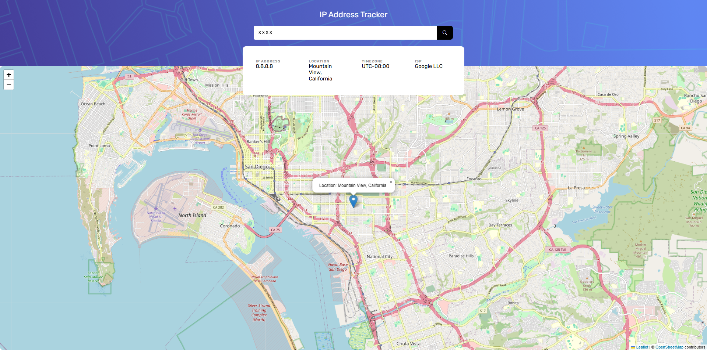

# Frontend Mentor - IP address tracker solution

This is a solution to the [IP address tracker challenge on Frontend Mentor](https://www.frontendmentor.io/challenges/ip-address-tracker-I8-0yYAH0). Frontend Mentor challenges help you improve your coding skills by building realistic projects. 

## Overview

### The challenge

Users should be able to:

- View the optimal layout for each page depending on their device's screen size
- See hover states for all interactive elements on the page
- See their own IP address on the map on the initial page load
- Search for any IP addresses or domains and see the key information and location

### Screenshot

### Links

- Solution URL: [Github](https://github.com/Tarikdirek)
- Live Site URL: [TrackerIP](https://trackeripmaster.netlify.app/)

### Built with

- HTML5 
- CSS
- Flexbox
- CSS Grid
- Mobile-first workflow
- ipify API
- Leaflet-OpenStreetMap

## Author

- Frontend Mentor - [@Tarikdirek](https://www.frontendmentor.io/profile/Tarikdirek)

